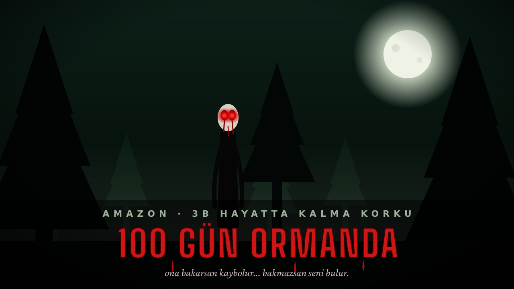

<p align="center"></p>

# 🌴🔪 100 GÜN ORMANDA — 3B Survival Horror (Masaüstü + Android)

Amazon ormanının derinliklerinde **100 gün** hayatta kalmaya çalıştığın, **gerçek 3B**,
ilk-şahıs, atmosferik ve **korkutucu** bir hayatta kalma-macera oyunu.

> Bu bir **website değil** — gerçek bir **uygulama**. Three.js (WebGL 3B) ile yapılıp
> **Electron** ile native masaüstü uygulamasına paketlenir (Discord / VS Code gibi).
> **Unity kullanılmadı.** Çift tıklayıp açılan bir `.exe` / `.AppImage` / `.dmg` üretir.

> ⚠️ **UYARI:** Oyun bilinçli **jump scare** ve ani yüksek sesler içerir. Korku öğeleri
> tasarımın merkezindedir. Kulaklık + ses açık önerilir.

---

## ⚡ EN KOLAY BAŞLATMA (kurulum derdi yok)

### Seçenek 1 — Hazır dosyayı indir, bas-oyna (sıfır kurulum) ⭐

👉 **İNDİRME (canlı):** **https://github.com/servankrall/100-Days-n-Forest/releases/latest**

Doğrudan indirme linkleri (v1.0.0):
- 🪟 **Windows — ÖNERİLEN, ~1.4 MB (Tauri):** [100.Gun.Ormanda_1.0.0_x64-setup.exe](https://github.com/servankrall/100-Days-n-Forest/releases/download/v1.0.0/100.Gun.Ormanda_1.0.0_x64-setup.exe) ⚡ saniyeler içinde iner
- 🤖 **Android:** [app-debug.apk](https://github.com/servankrall/100-Days-n-Forest/releases/download/v1.0.0/app-debug.apk) (~4 MB, telefonda "bilinmeyen kaynaklara izin ver")
- 🍎 **macOS (Apple Silicon):** [100.Gun.Ormanda-1.0.0-arm64.dmg](https://github.com/servankrall/100-Days-n-Forest/releases/download/v1.0.0/100.Gun.Ormanda-1.0.0-arm64.dmg)
- 🐧 **Linux:** [100.Gun.Ormanda-1.0.0.AppImage](https://github.com/servankrall/100-Days-n-Forest/releases/download/v1.0.0/100.Gun.Ormanda-1.0.0.AppImage)

İndir → çift tık → kurulum **kendiliğinden** olur → oyna.

> 🪟 Windows'ta küçük Tauri kurulumu sistemin **WebView2**'sini kullanır (Win10/11'de zaten var).
> Yoksa kurulum sırasında otomatik iner. Büyük 78 MB'lık Electron `.exe`'ye gerek yok.
>
> 🛡️ **"Windows bilgisayarınızı korudu / Bilinmeyen yayıncı" (SmartScreen) uyarısı çıkarsa:**
> Uygulama imzasız olduğu için normaldir, virüs değildir. **"Daha fazla bilgi" → "Yine de
> çalıştır"** de, sonra UAC için **Evet**. (Alternatif: dosyaya sağ tık → Özellikler →
> "Engellemeyi Kaldır".) İmzasız tüm bağımsız uygulamalarda bu adım vardır.

> Yeni sürüm üretmek: `v1.1.0` gibi bir etiket it ya da **Actions → "Uygulamaları Derle" → Run workflow**.

### Seçenek 2 — Tek tık başlatıcı (otomatik kurulum)
Depoyu indir, sonra:
- **Windows:** `start.bat`'a **çift tıkla**
- **macOS / Linux:** `./start.sh` çalıştır (veya çift tıkla)

Eksik dosyalar **arka planda otomatik kurulur**, sonra oyun açılır. Tek ön koşul:
[Node.js](https://nodejs.org). Elle `npm install` yapmana gerek yok.

> Terminal sevenler için aynısı: `npm run play`

---

## ▶️ Geliştirici Çalıştırma / Kurulabilir Üretme

```bash
npm install      # Three.js + Electron'u indirir
npm start        # oyunu native bir pencerede açar
```

İlk açılışta **BAŞLA**'ya bas; fare ekrana kilitlenir (Esc ile bırakılır).

Kurulabilir dosya (.exe / .AppImage / .dmg) üretmek:

```bash
npm run dist          # bulunduğun işletim sistemi için
npm run dist:win      # Windows kurulum sihirbazı (.exe)
npm run dist:linux    # Linux (.AppImage)
npm run dist:mac      # macOS (.dmg)
```

Çıktılar `dist/` klasöründe oluşur.

---

## 🎮 Kontroller

| Aksiyon | 🖥️ PC | 📱 Mobil |
|---|---|---|
| Etrafa bak | **Tıkla** (fareyi kilitle) + fareyi oynat | Sağ ekranı **sürükle** |
| Hareket | `W A S D` | Sol **joystick** |
| Koş | `Shift` | **KOŞ** butonu |
| Vur (odun kes / avlan) | **Sol tık** veya `E` | **VUR** butonu |
| Ateş yak / odun ekle | `F` | **🔥** butonu |
| Ye | `G` | **🍗** butonu |
| Fareyi bırak / Duraklat | `Esc` / ⏸ | ⏸ butonu |
| Tam ekran / Konsol | `F11` / `F12` | — |

> 👁️ **İPUCU:** Geceleri ağaçların arasında seni izleyen **uzun, kanlı adama** doğru
> nişan al / **bak** — o zaman kaybolur. Bakmazsan akıl sağlığını emer ve üstüne atlar.

---

## 🎯 Amaç & Mekanikler

- **100 gün hayatta kal.** Gerçek 3B gündüz-gece döngüsü; 100. günü tamamla = kazandın.
- **5 hayatta kalma çubuğu:** ❤️ Sağlık · 🍖 Açlık · 🔥 Sıcaklık · 🧠 Akıl Sağlığı · ⚡ Enerji.
- **Odun kes** → ağaca bak ve VUR. **Ateş yak** (5 odun) → ışık, sıcaklık, akıl sağlığı,
  jaguarları korkutur ve **çiğ eti pişirir** (ateşin yanında dur).
- **Avlan:** kapibara, geyik, tapir; yaban domuzu saldırır; geceleri **jaguar** seni avlar.
- **Ye:** pişmiş et en iyisi; çiğ et seni hasta edebilir.

## 👁️ Korku Sistemi

- **İzleyen (uzun, kanlı adam):** Geceleri ağaçların arasında, hareketsiz, sana bakarak
  belirir — **3B'de doğrudan ona baktığında kaybolur.** Bakmazsan yaklaşır, akıl sağlığını
  emer ve yeterince yaklaşınca **üstüne atlar (jumpscare).**
- **Gece jump scare'leri:** Ekranı kaplayan kanlı yüz + çığlık + ekran sarsıntısı.
  İlk gece **garantili** bir korkutma seni bekliyor.
- **Atmosfer:** Yoğun gece sisi, kafa lambası ışığıyla dar görüş, kalp atışı (tehlike
  yaklaşınca hızlanır), fısıltılar, akıl sağlığı düşünce ekran bozulması, tamamen
  **prosedürel** ses motoru (uğultu, rüzgar, ateş çıtırtısı, hırıltı, çığlık).

---

## ✨ Görsel & Atmosfer

- **Sinematik renk** (ACES tone mapping) ve gün içinde değişen ışık; **şafak/akşam altın tonu**.
- **Daha güzel orman:** her ağaç farklı yeşil/kahve tonunda, dolgun çift katmanlı yaprak;
  yere serpiştirilmiş **çimen/eğrelti tutamları** ve renk çeşitliliğiyle çalılar.
- **Gerçek gölgeler** (masaüstünde; güneş gölgesi oyuncuyu takip eder).
- **Gece:** soluk **ay ışığı** silüetleri, uçuşan **ateş böcekleri**, yoğun sis ve dar görüş.
- **Kamp ateşi:** çift alev + yükselen **kıvılcımlar** + titreşen sıcak ışık.

> Not: Gölgeler/parçacıklar performans için telefonda otomatik sadeleştirilir.

## 🗂️ Proje Yapısı

```
.
├── start.bat / start.sh   # tek-tık başlatıcı (otomatik kurulum)
├── launch.cjs             # başlatıcının çekirdeği (npm install gerekirse + başlat)
├── package.json           # bağımlılıklar + electron-builder + mobil scriptler
├── main.js                # Electron ana süreç (native masaüstü pencere)
├── index.html             # uygulama arayüzü (importmap → yerel Three.js)
├── app.css                # karanlık korku teması, mobil uyumlu
├── vite.config.mjs        # mobil için web paketleyici (www/ üretir)
├── capacitor.config.json  # Android sarmalayıcı ayarı (webDir: www)
├── .github/workflows/     # otomatik derleme (exe/dmg/AppImage/apk)
├── src/
│   └── game3d.js          # 3B oyun motoru: orman + hayatta kalma + korku + ses
├── web-2d/                # hafif 2B tarayıcı sürümü (yedek/hızlı oyna)
├── www/                   # (üretilen) Vite paketi — git'te yok
└── android/               # (üretilen) Capacitor Android projesi — git'te yok
```

- **Bağımlılık:** sadece `three` (çalışma) + `electron`, `electron-builder` (geliştirme).
- 3B render: Three.js / WebGL. Sesler Web Audio API ile prosedürel (ses dosyası yok).
- `index.html` `three`'yi **import map** ile yerel `node_modules`'tan yükler — paketleyici (bundler) gerekmez.

---

## 📱 Mobil Uygulama (Android APK)

Aynı 3B kod **dokunmatik** kontrolleri (joystick + sürükleyerek bakış) zaten içeriyor.
Capacitor + Vite kurulumu **hazır ve doğrulandı** — web varlıkları Vite ile tek pakete
derlenip (`www/`) Android projesine gömülüyor.

**Ön koşul:** [Android Studio](https://developer.android.com/studio) (içinde Android SDK +
JDK 17 gelir).

```bash
npm install            # (bir kez) tüm bağımlılıklar
npm run mobile:add     # (bir kez) www/ derler + android/ native projesini oluşturur
npm run mobile:open    # her seferinde: derle + senkronla + Android Studio'da aç
```

Android Studio açıldığında: **Run ▶** (cihaz/emülatör) veya **Build > Build APK(s)**.

CLI'dan doğrudan APK (Android SDK kuruluysa, `android/` oluştuktan sonra):

```bash
npm run mobile:sync                       # son web derlemesini Android'e kopyalar
cd android && ./gradlew assembleDebug     # -> android/app/build/outputs/apk/debug/app-debug.apk
```

Cihaza/emülatöre doğrudan kurup çalıştırmak için: `npm run mobile:run`.

> Bu bulut ortamında `cap add android` adımına kadar her şey **çalıştırılıp doğrulandı**
> (Vite paketi `www/` + Android projesi + varlık kopyalama). Yalnızca son APK derlemesi
> Android SDK/Gradle gerektirdiği için senin makinende yapılır. İstersen özel uygulama
> ikonu/açılış ekranı da ekleyebilirim.

---

## 🙏 Krediler / Lisans
- Uçan kuş modelleri (Parrot/Flamingo/Stork): three.js örnek varlıkları, **CC0** (kamuya açık).
- Three.js (MIT), PeerJS (MIT). Oyun kodu: MIT.

## 🗺️ Yol Haritası
- [x] Masaüstü uygulaması (Three.js + Electron).
- [x] Android paketleme altyapısı (Capacitor + Vite) — `cap add android`'e kadar doğrulandı.
- [ ] Özel uygulama ikonu + açılış ekranı (Android/masaüstü).
- [ ] **Çok oyunculu co-op (5 kişiye kadar)** — WebRTC ile; biri oda kurar, diğerleri katılır,
      İzleyen'i herkes aynı anda görür.
- [ ] Kalıcı kayıt (kaldığın günden devam).
- [ ] Barınak/çadır, mızrak, tuzak, meşale; yağmur/sis/fırtına; daha fazla korku senaryosu.

---

## 🧪 Doğrulama notu

3B render gerçek bir GPU/tarayıcı gerektirdiğinden ve bu ortam GUI/derleme aracı içermediğinden,
geliştirme sırasında: modül söz dizimi, **kullanılan tüm Three.js API'lerinin gerçekten var olduğu**
(r160) ve oyun **mantığı** (hareket+çarpışma, istatistikler, İzleyen, hayvanlar, gün döngüsü)
binlerce kare boyunca istisna/NaN olmadan otomatik test edildi. Görsel render'ı kendi makinende
`npm start` ile göreceksin.
